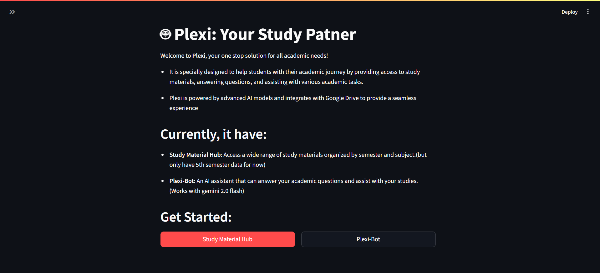
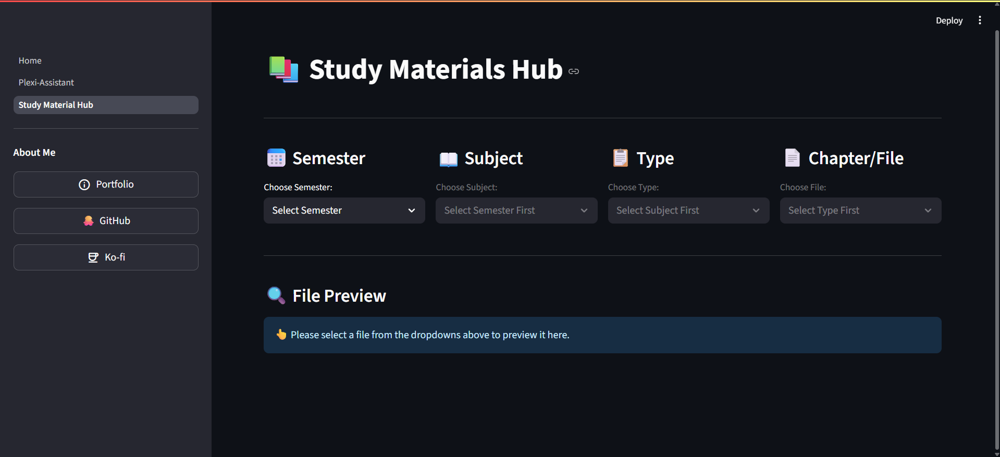
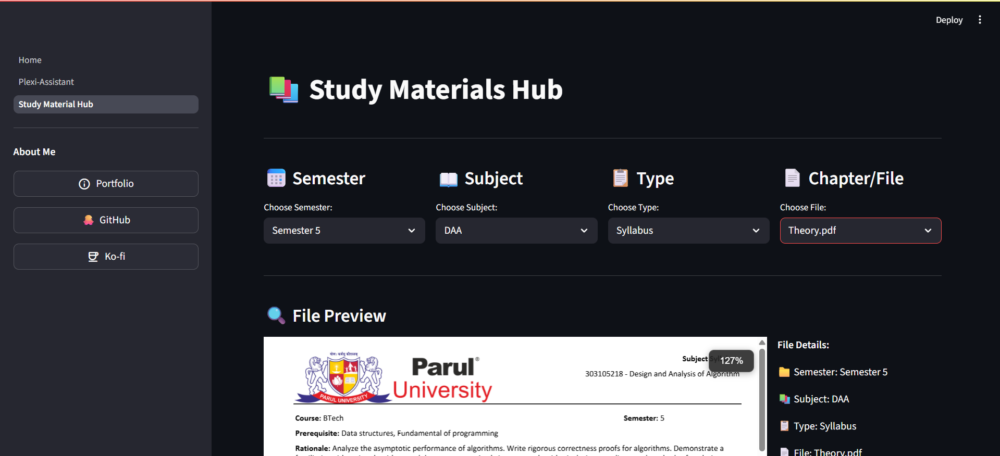
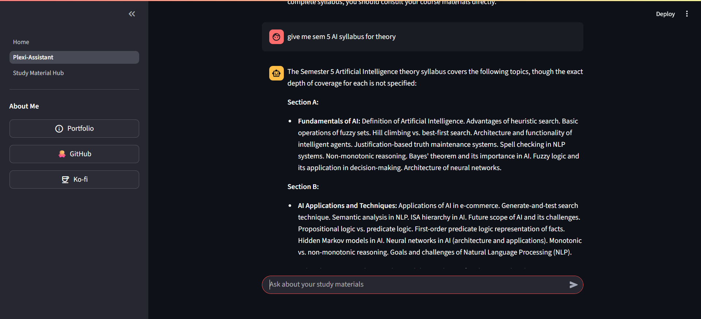

# Plexi

  

  <strong>Your AI-powered study companion for Parul University CS students.</strong>

  

---

## What is Plexi?

Plexi is a free web app that gives Collage students easy access to study materials and an AI assistant — all in one place. No setup, no accounts, just open and start studying.

---

## What can you do?

### Study Material Hub

Browse and download notes, slides, and other materials organized by **semester → subject → type**. PDFs open right in the browser — no extra apps needed.

- Filter by semester, subject, and file type
- In-Build PDF Viewer
- Download any file with one click

### Plexi Assistant

Chat with an AI that **only answers using actual study materials from Database** — no hallucinations, no random internet answers. It works like Google's NotebookLM but specifically for your course content.

- Pick any OpenAI Compatible LLM provider — **Gemini, ChatGPT, Mistral, Groq, OpenRouter**, or even a local model(Ollama or LM Studio)
- Every answer includes **source citations** so you know exactly where the information came from
- Bring your own API key (free tiers available from most providers)

### Contribute Materials

Have notes that could help others? Submit them through a simple form — they'll be reviewed and added for everyone automatically.

---

## Screenshots

| Home | Study Material Hub |
|:---:|:---:|
|  |  |

| Material Preview | Plexi Assistant |
|:---:|:---:|
|  |  |

---

## How it works

1. **Pick your scope** — Select a semester and subject
2. **Browse or chat** — View files in the Hub, or ask the AI assistant questions grounded in your materials
3. **Get cited answers** — Every response references the exact source file so you can verify and study further

---

## Built by

**Kunal Gupta** (LazyHuman)

- [lazyhideout.tech](https://lazyhideout.tech)
- [github.com/KunalGupta25](https://github.com/KunalGupta25)
- [ko-fi.com/lazy_human](https://ko-fi.com/lazy_human)

---

## License

This project is licensed under the [MIT License](LICENSE).

---

> Made with ❤️ by Kunal aka LazyHuman